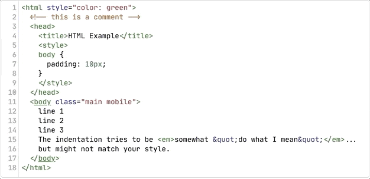

# Emmet extension for CodeMirror editor

[CodeMirror](http://codemirror.net/) extension that adds [Emmet](https://emmet.io) support to text editor.

## How to use

This extension can be installed as a regular npm module:

```
npm i @emmetio/codemirror-plugin
```

The package comes in two flavors: a stand-alone browser bundle and ES/CommonJS modules that you can use in your app.

If you’re building an app, you can use extension like this:

```js
import CodeMirror from 'codemirror';
import emmet from '@emmetio/codemirror-plugin';

// Register extension on CodeMirror object
emmet(CodeMirror);

// Create editor instance and provide keymap for Emmet actions
const editor = CodeMirror.fromTextArea(document.getElementById('code'), {
    mode : "text/html",
    extraKeys: {
        'Tab': 'emmetExpandAbbreviation',
        'Esc': 'emmetResetAbbreviation',
        'Enter': 'emmetInsertLineBreak'
    }
});
```

For a stand-alone, basic usage, simply add `dist/browser.js` file into your page:

```html
<script src="./node_modules/codemirror/lib/codemirror.js"></script>
<script src="./node_modules/@emmetio/codemirror-plugin/dist/browser.js"></script>

<form>
    <textarea id="code" name="code"></textarea>
</form>

<script>
var editor = CodeMirror.fromTextArea(document.getElementById("code"), {
    mode : "text/html",
    extraKeys: {
        'Tab': 'emmetExpandAbbreviation',
        'Esc': 'emmetResetAbbreviation',
        'Enter': 'emmetInsertLineBreak'
    }
});
</script>
```

## Expanding abbreviations

Emmet extension can _track abbreviations_ that user enters in some known syntaxes like HTML and CSS. When user enters something that looks like Emmet abbreviation, extension starts abbreviation tracking (adds `emmet-abbreviation` class to a text fragment). WHen abbreviation becomes _complex_ (expands to more that one element), it displays abbreviation preview:



Run `emmetExpandAbbreviation` command to expand tracked abbreviation or `emmetResetAbbreviation` to reset it. Suggested key bindings are <kbd>Tab</kbd> for `emmetExpandAbbreviation` and <kbd>Esc</kbd> for `emmetResetAbbreviation`.

Abbreviation tracker is _context-aware_: it detect current syntax context and works only where abbreviation expected. For example, in HTML syntax it works in plain text context only and doesn’t work, for example, in attribute value or tag name.

If you already have abbreviation in editor, you can _capture_ it to continue editing: run `emmetCaptureAbbreviation` action (<kbd>Ctrl-Space</kbd> by default):


### Abbreviation mode

In case if abbreviation tracking is unavailable or you want to give user an opportunity to enter and expand abbreviation with interactive preview, a special _abbreviation mode_ is available. Run `emmetEnterAbbreviationMode` command to enter this mode: everything user types will be tracked as abbreviation with preview and validation. Use `emmetExpandAbbreviation` command to expand it or `emmetResetAbbreviation` to quit abbreviation mode.

### JSX abbreviation

In order to not distract user with unexpected abbreviation tracking, in JSX syntax Emmet requires to prefix abbreviation with `<` to provide more natural context where JSX markup is required.


## Tag pair marking and renaming

Extension is able to mark paired open and close HTML tags in editor: it adds `emmet-class-tag` and `emmet-close-tag` name to matched tag names. Optionally, extension can display preview of matching open tag when cursor is inside close tag.

When tag pair tag marking is enabled, it’s possible to automatically rename tag pair when you update open or close tag:


## Commands

The package itself follows CodeMirror extension convention and registers new commands in CodeMirror namespace. In order to use Emmet, you should create CodeMirror instance and provide keymap with the following Emmet actions:

* `emmetExpandAbbreviation` – expand _tracked_ abbreviation from current cursor position (see [Expanding abbreviations](#expanding_abbreviations)).
* `emmetResetAbbreviation` – reset _tracked_ abbreviation in editor (see [Expanding abbreviations](#expanding_abbreviations)).
* `emmetEnterAbbreviationMode` – enters abbreviation mode.
* `emmetInsertLineBreak` – inserts formatted line break if cursor is between tags.
* `emmetExpandAbbreviationAll` – expands abbreviation from current cursor position. Unlike `emmetExpandAbbreviation`, it doesn’t require tracked abbreviation: it extracts abbreviation from current cursor position and can be used in any document syntax.
* `emmetWrapWithAbbreviation` — [Wrap with Abbreviation](https://docs.emmet.io/actions/wrap-with-abbreviation/).
* `emmetBalance`/`emmetBalanceInward` — [Balance](https://docs.emmet.io/actions/match-pair/).
* `emmetToggleComment` — [Toggle Comment](https://docs.emmet.io/actions/toggle-comment/)
* `emmetEvaluateMath` — [Evaluate Math Expression](https://docs.emmet.io/actions/evaluate-math/)
* `emmetGoToNextEditPoint`/`emmetGoToPreviousEditPoint` — [Go to Edit Point](https://docs.emmet.io/actions/go-to-edit-point/)
* `emmetGoToTagPair` — [Go to Matching Pair](https://docs.emmet.io/actions/go-to-pair/)
* `emmetIncrementNumberN`/`emmetDecrementNumberN` — [Increment/Decrement Number](https://docs.emmet.io/actions/inc-dec-number/) where `N` is `1`, `01` or `10`.
* `emmetRemoveTag` — [Remove Tag](https://docs.emmet.io/actions/remove-tag/)
* `emmetSplitJoinTag` — [Split/Join Tag](https://docs.emmet.io/actions/split-join-tag/)
* `emmetSelectNextItem`/`emmetSelectPreviousItem` — [Select Item](https://docs.emmet.io/actions/select-item/)

### Options

You can pass `emmet` object when creating CodeMirror editor instance to modify extension behavior:

```js
CodeMirror.fromTextArea(document.getElementById("code"), {
    mode : "text/html",
    lineNumbers : true,

    // Pass Emmet extension options
    emmet: {
        mark: true,
        markTagPairs: true,
        previewOpenTag: false,
    }
});
```

Extension supports the following options:

* `mark` (boolean or string[]): enables abbreviation tracking and marking in editor. If `true` is provided, it will work in all known syntaxes. You can specify array of syntaxes/modes where abbreviation marking should work; array may include `markup` or `stylesheet` keyword to enable option for all known markup or stylesheet syntaxes.
* `preview` (boolean or string[]): enable preview of tracked abbreviation. Preview is displayed only when abbreviation will expand in more than one element. Same as with `mark` option, you can enable it for all syntaxes (`true`) or limit it to specified syntaxes or syntax groups.
* `markTagPairs` (boolean): enable HTML tag pair marking in editor.
* `previewOpenTag` (boolean): displays open tag preview when cursor is inside its matching closing tag. Preview is displayed only if open tag has attributes and works only if `markTagPairs` is enabled
* `autoRenameTags` (boolean): automatically rename tag pair when updating open or close tag name. Works only if `markTagPairs` is enabled.
* `attributeQuotes` (`'single'` or `'double'`): quotes to use in generated HTML attribute values. Default is `'double'`.
* `markupStyle` (`'html'`, `'xhtml'` or `'xml'`): style for self-closing elements (like `<br>`) and boolean attributes in HTML syntax.
* `comments` (boolean): enable automatic tag commenting. When enabled, elements generated from Emmet abbreviation with `id` and/or `class` attributes will receive a comment with these attribute values.
* `commentsTemplate` (string): commenting template. Default value is `\n<!-- /[#ID][.CLASS] -->`. Outputs everything between `[` and `]` only if specified attribute name (written in UPPERCASE) exists in element. Attribute name is replaced with actual value. Use `\n` to add a newline.
* `bem` (boolean): enable BEM support. When enabled, Emmet will treat class names starting with `-` as _element_ and with `_` as _modifier_ in BEM notation. These class names will inherit `block` name from current or ancestor element. For example, the abbreviation `ul.nav.nav_secondary>li.nav__item` can be shortened to `ul.nav._secondary>li.-item` when this option enabled.
* `config` (object): Emmet config with snippets and advanced options.

### Emmet config

With `config` option (see above) you can add custom abbreviation snippets and fine-tune Emmet behavior.

Snippets are grouped by syntax (like `html`, `css`, `pug` etc.) and syntaxes are grouped by type: `markup` or `stylesheet`. You can specify snippets that should be available for all syntaxes in group or specific syntax only.

Snippets are just short aliases for Emmet abbreviations: you either specify shorthand for a larger abbreviation or define shape for a specific element:

```js
CodeMirror.fromTextArea(document.getElementById("code"), {
    mode : "text/html",
    lineNumbers : true,

    // Pass Emmet extension options
    emmet: {
        config: {
            // Specify snippets for all markup syntaxes: HTML, XML, Pug etc.
            markup: {
                // Shorthand for larger abbreviation
                foo: 'div.foo>section.bar*3',

                // Define shape of element, looks like recursive abbreviation
                a: 'a[href title]',
                br: 'br/'
            },

            // Specify snippets for specific syntax only
            html: {
                nav: 'ul.nav>.nav-item*4>a'
            }
        }
    }
});
```

Note that markup and stylesheet snippet definitions are different. Markup snippets are written as Emmet abbreviations (e.g. you simply describe element name and its default attributes) while stylesheet snippets are aliases to CSS properties with optional keywords list, separated by `|` character. These keywords are used in abbreviation resolving process. For more examples, see check out [default Emmet snippets](https://github.com/emmetio/emmet/tree/master/snippets).

See all available config params in [`GlobalConfig` type](https://github.com/emmetio/emmet/blob/master/src/config.ts#L26).
